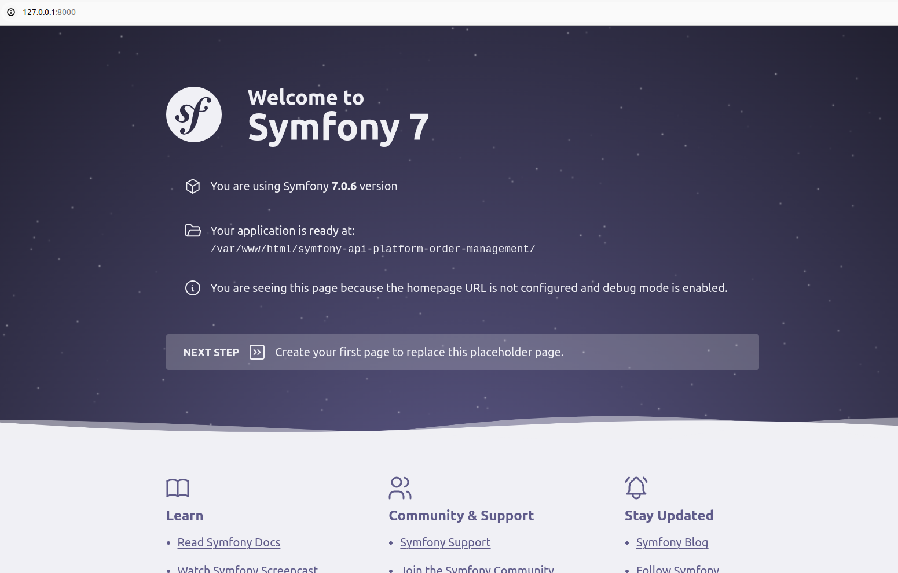
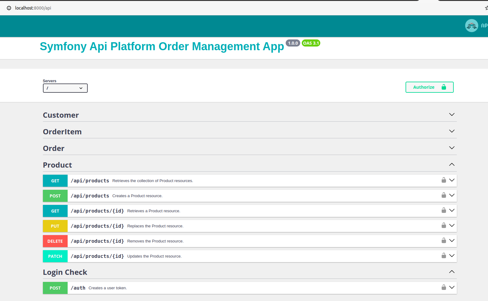
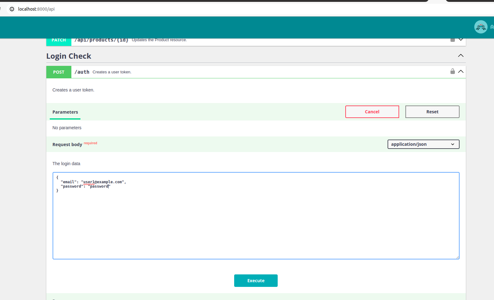
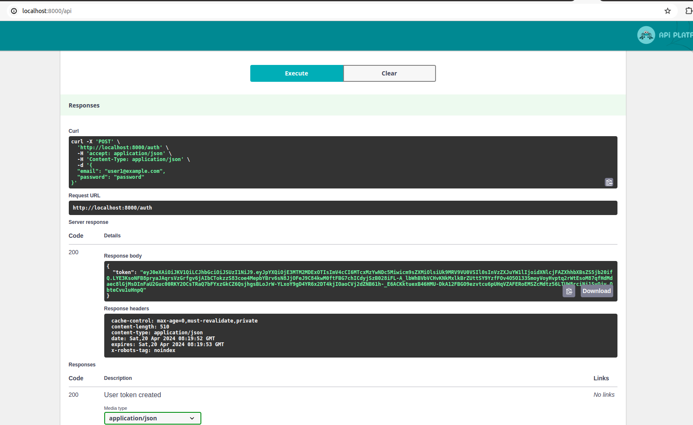
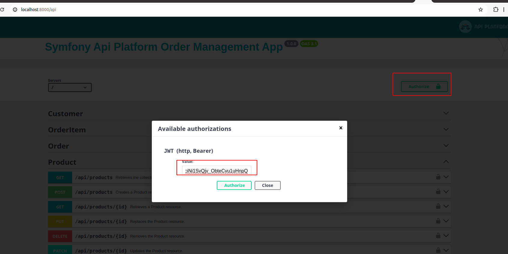
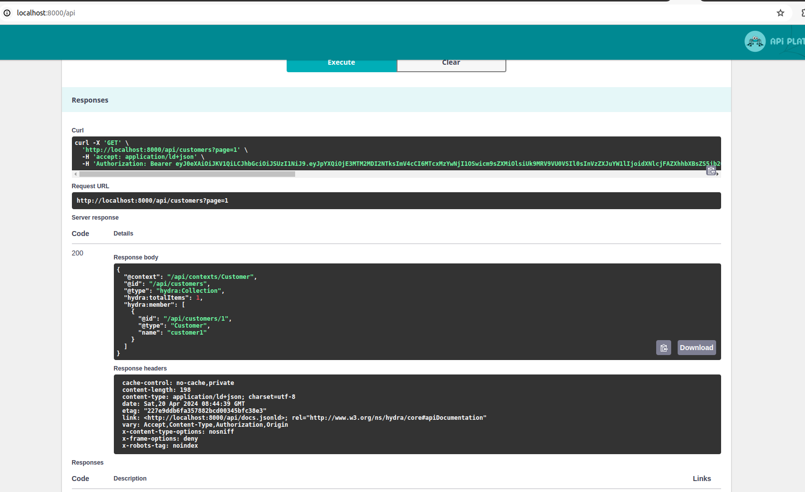

# Symfony Api Platform Order Management App
This Symfony application functions as an order management system, offering API endpoints built with API Platform. It includes entities such as Order, Order Item, Customer, Product, and User. Additionally, JWT token integration ensures the security and verification of API endpoints.

Reference: [API platform](https://api-platform.com/docs/distribution/)

This contains endpoints for the entities Order, Order Item, Customer, and Product. Also, please note that there is a JWT token generation endpoint available.

## Installation
1. Clone this repository.
2. Run `composer install` to install symfony dependencies.
3. Configure database details in `.env`. Make sure, you created new database.
4. Run all migrations `php bin/console doctrine:migrations:migrate`.
5. Run all fixtures `php bin/console doctrine:fixtures:load --append`. Generally, added for 10 dummy users to generate JWT token.
6. Run inbuild command `php artisan app:process-orders` to import orders from json file. It will show message after it ran.
7. Running Symfony `symfony server:start`
You will get local end point to access this application.
Like: `http://127.0.0.1:8000/`. Open it and you will see symfony page. 



8. Now you can check the full list of available APIs in the application.
Link: `http://127.0.0.1:8000/api`



## API Reference

#### Get token

```http
  POST /auth
```

JSON Payload
```
{
  "email": "string",
  "password": "string"
}
```


You will have a token



Copy that token and add in to Authrize window and then close popup



Now you can access APIs because it has a valid JWT token.
For Example, I have tried to access GET `api/customers`



### Additional Notes
There's much potential to enhance the existing codebase:

- This API endpoint is quite basic, so integrating serializers with groups could enhance its functionality. Please check Customer entity.
- Sometimes you need to remove default endpoints and add specific ones. How can you achieve this? Please check the `get`, `getCollection` operation methods added in the Customer entity.
- Implementing lazy loading would optimize resource usage and improve performance.
- Integrating search and sorting features would add valuable functionality to the API.

Feel free to explore and modify the code to meet your specific requirements!"
